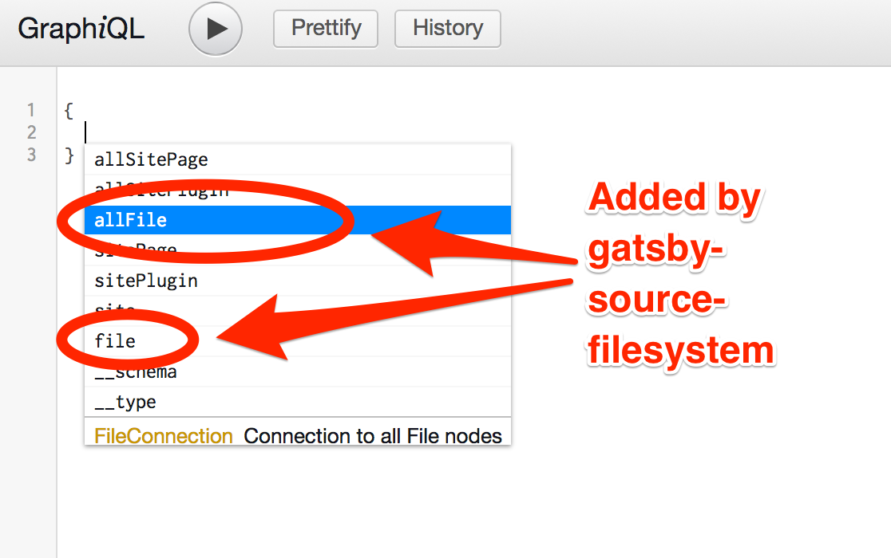
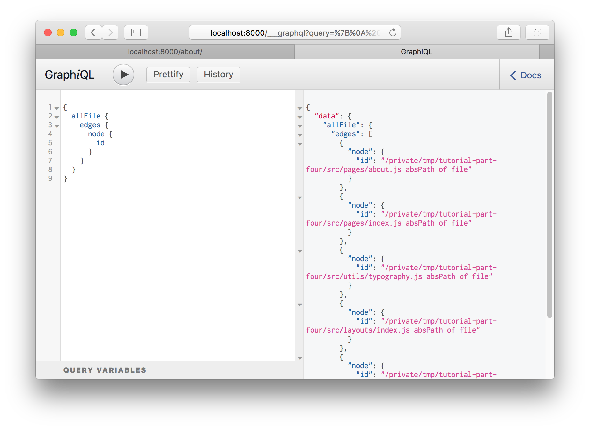
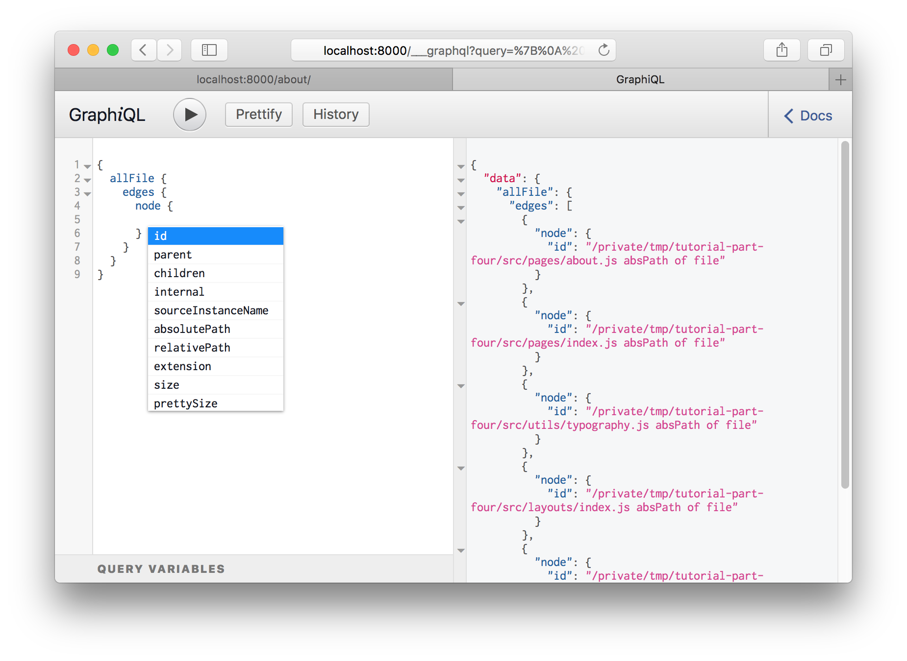
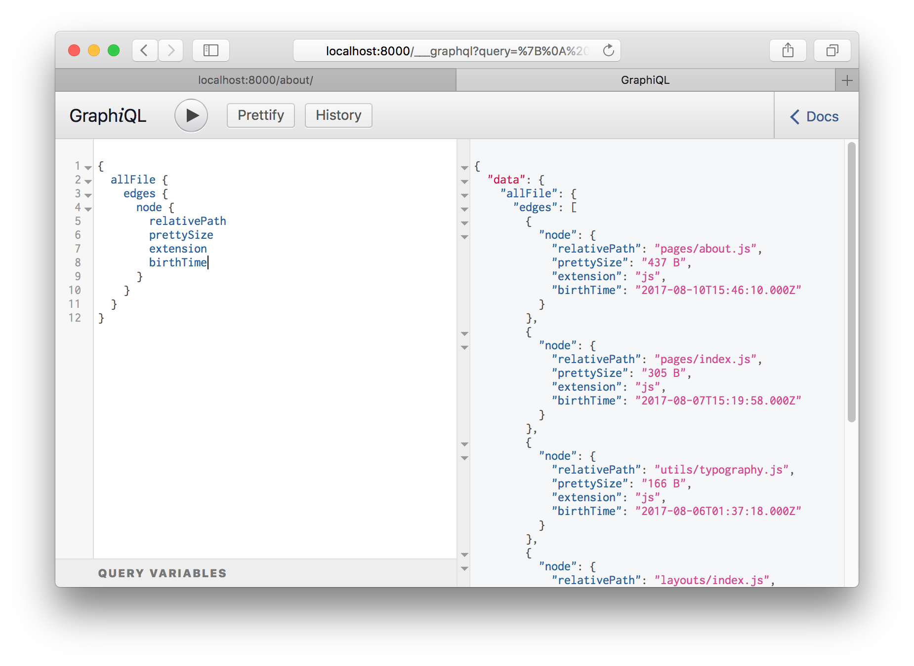
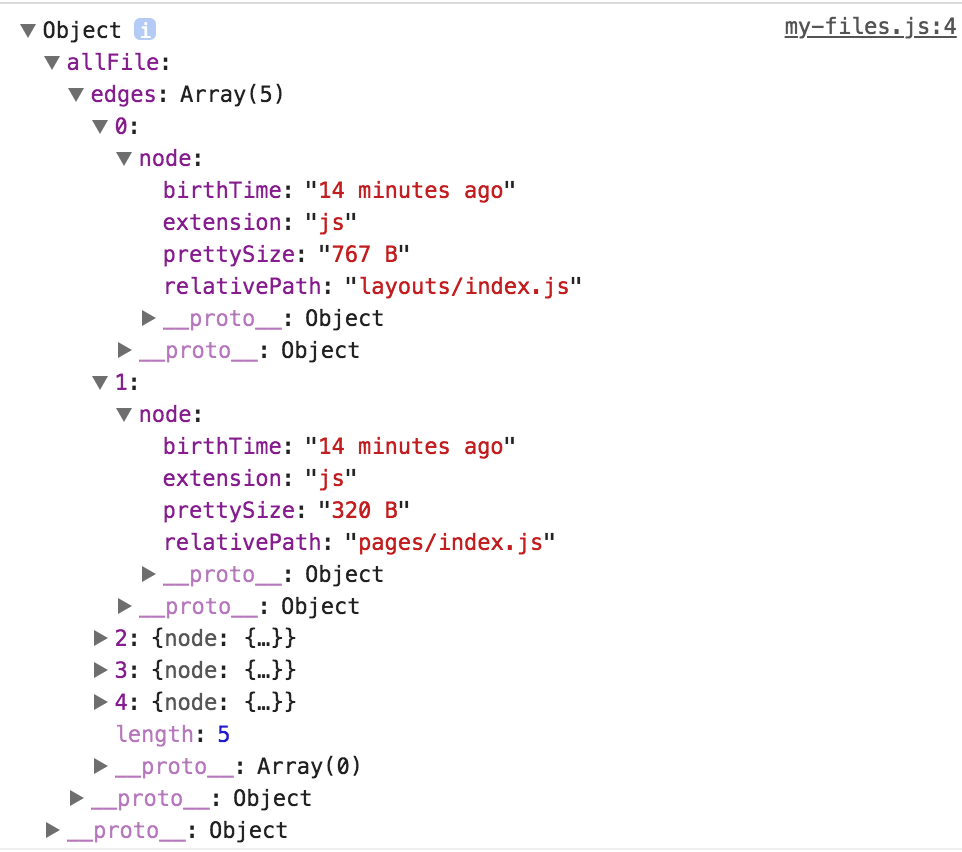
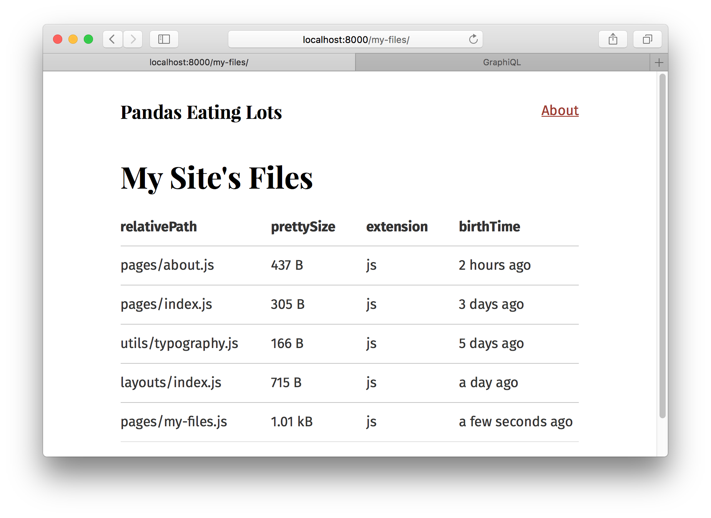

> Este tutorial es parte de una serie sobre la capa de datos de Gatsby. Asegúrate de haber terminado antes la [parte 4](/tutorial/part-four/) antes de continuar aquí.

## ¿Qué abarca este tutorial?

En este tutorial aprenderás como jalar datos a tu sitio de Gatsby usando GraphQL y plugins de fuentes de datos. Sin embargo, antes de aprender acerca de estos plugins, será bueno saber cómo usar algo llamado GraphiQL, una herramienta que te ayuda a estructurar tus consultas de manera correcta.

## Presentando GraphiQL

GraphiQL es el entorno de desarrollo integrado para GraphQL. Es una herramienta poderosa (y asombrosa) que usarás a menudo al crear sitios web de Gatsby.

Puedes usarla cuando tu sitio de desarrollo este corriendo de manera normal en 
<http://localhost:8000/___graphql>.

<video controls="controls" autoplay="true" loop="true">
  <source type="video/mp4" src="/graphiql-explore.mp4"></source>
  <p>Your browser does not support the video element.</p>
</video>

Investiga con `Site` y ve que campos están disponibles dentro, incluyendo el `siteMetadata` que consultaste antes. `Site` es un "tipo" de dato incorporado en Gatsby. ¡Intenta abriendo GraphiQL y juega con tus datos! Presiona <kbd> Ctrl + Space </kbd> (o usa <kbd> Shift + Space </kbd> como un shortcut alternativo) para abrir la ventana de autocompletar y <kbd> Ctrl + Enter </kbd> para ejecutar el Consulta GraphQL. Utilizaráz GraphiQL mucho más durante el resto del tutorial.

## Usando el explorador de GraphiQL

El explorador de GraphiQL te permite construir consultas de manera interactiva, haciendo click en los campos y entradas disponibles, evitando el repetitivo proceso de escribir estas consultas mano.

<EggheadEmbed
  lessonLink="https://egghead.io/lessons/gatsby-build-a-graphql-query-using-gatsby-s-graphiql-explorer"
  lessonTitle="Build a GraphQL Query using Gatsby’s GraphiQL Explorer"
/>

## Plugins de fuentes de datos

Data in Gatsby sites can come from anywhere: APIs, databases, CMSs, local files, etc.

Source plugins fetch data from their source. E.g. the filesystem source plugin knows how to fetch data from the file system. The WordPress plugin knows how to fetch data from the WordPress API.

Add [`gatsby-source-filesystem`](/packages/gatsby-source-filesystem/) and explore how it works.

First, install the plugin at the root of the project:

```shell
npm install --save gatsby-source-filesystem
```

Then add it to your `gatsby-config.js`:

```javascript:title=gatsby-config.js
module.exports = {
  siteMetadata: {
    title: `Pandas Eating Lots`,
  },
  plugins: [
    // highlight-start
    {
      resolve: `gatsby-source-filesystem`,
      options: {
        name: `src`,
        path: `${__dirname}/src/`,
      },
    },
    // highlight-end
    `gatsby-plugin-emotion`,
    {
      resolve: `gatsby-plugin-typography`,
      options: {
        pathToConfigModule: `src/utils/typography`,
      },
    },
  ],
}
```

Save that and restart the gatsby development server. Then open up GraphiQL
again.

If you bring up the autocomplete window, you'll see:



Hit <kbd>Enter</kbd> on `allFile` then type <kbd>Ctrl + Enter</kbd> to run a
query.



Delete the `id` from the query and bring up the autocomplete again (<kbd>Ctrl +
Space</kbd>).



Try adding a number of fields to your query, pressing <kbd>Ctrl + Enter</kbd>
each time to re-run the query. You'll see something like this:



The result is an array of File "nodes" (node is a fancy name for an object in a
"graph"). Each File object has the fields you queried for.

## Build a page with a GraphQL query

Building new pages with Gatsby often starts in GraphiQL. You first sketch out
the data query by playing in GraphiQL then copy this to a React page component
to start building the UI.

Let's try this.

Create a new file at `src/pages/my-files.js` with the `allFile` GraphQL query you just
created:

```jsx:title=src/pages/my-files.js
import React from "react"
import { graphql } from "gatsby"
import Layout from "../components/layout"

export default ({ data }) => {
  console.log(data) // highlight-line
  return (
    <Layout>
      <div>Hello world</div>
    </Layout>
  )
}

export const query = graphql`
  query {
    allFile {
      edges {
        node {
          relativePath
          prettySize
          extension
          birthTime(fromNow: true)
        }
      }
    }
  }
`
```

The `console.log(data)` line is highlighted above. It's often helpful when
creating a new component to console out the data you're getting from the GraphQL query
so you can explore the data in your browser console while building the UI.

If you visit the new page at `/my-files/` and open up your browser console
you will see something like:



The shape of the data matches the shape of the GraphQL query.

Add some code to your component to print out the File data.

```jsx:title=src/pages/my-files.js
import React from "react"
import { graphql } from "gatsby"
import Layout from "../components/layout"

export default ({ data }) => {
  console.log(data)
  return (
    <Layout>
      {/* highlight-start */}
      <div>
        <h1>My Site's Files</h1>
        <table>
          <thead>
            <tr>
              <th>relativePath</th>
              <th>prettySize</th>
              <th>extension</th>
              <th>birthTime</th>
            </tr>
          </thead>
          <tbody>
            {data.allFile.edges.map(({ node }, index) => (
              <tr key={index}>
                <td>{node.relativePath}</td>
                <td>{node.prettySize}</td>
                <td>{node.extension}</td>
                <td>{node.birthTime}</td>
              </tr>
            ))}
          </tbody>
        </table>
      </div>
      {/* highlight-end */}
    </Layout>
  )
}

export const query = graphql`
  query {
    allFile {
      edges {
        node {
          relativePath
          prettySize
          extension
          birthTime(fromNow: true)
        }
      }
    }
  }
`
```

And… 😲



## What's coming next?

Now you've learned how source plugins bring data _into_ Gatsby’s data system. In the next tutorial, you'll learn how transformer plugins _transform_ the raw content brought by source plugins. The combination of source plugins and transformer plugins can handle all data sourcing and data transformation you might need when building a Gatsby site. Learn about transformer plugins in [part six of the tutorial](/tutorial/part-six/).
