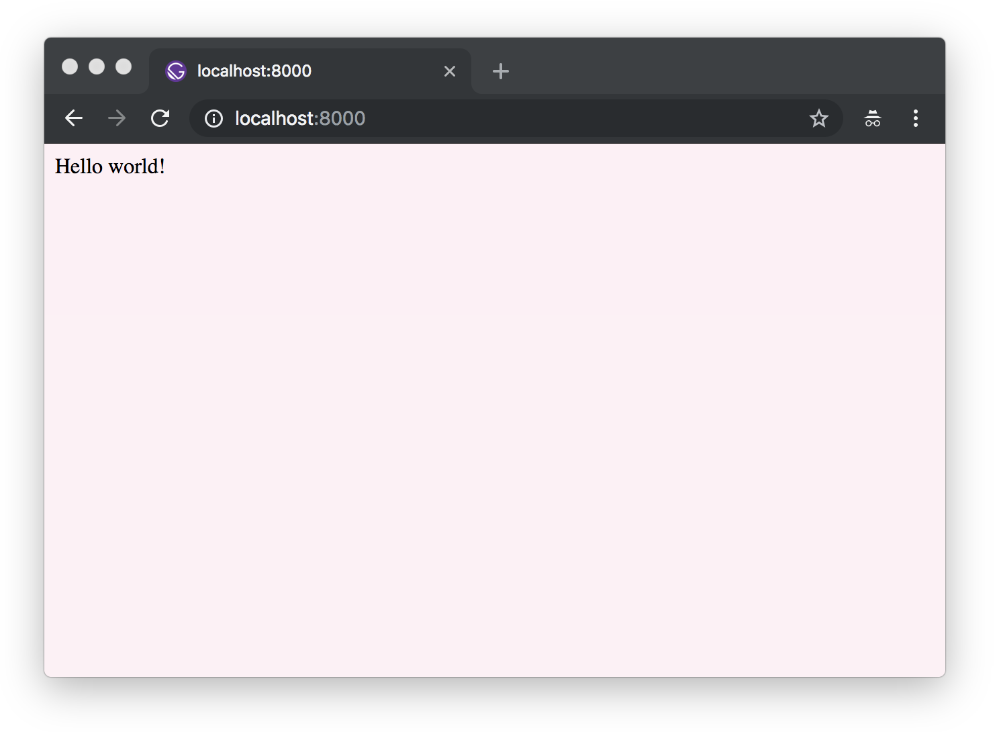
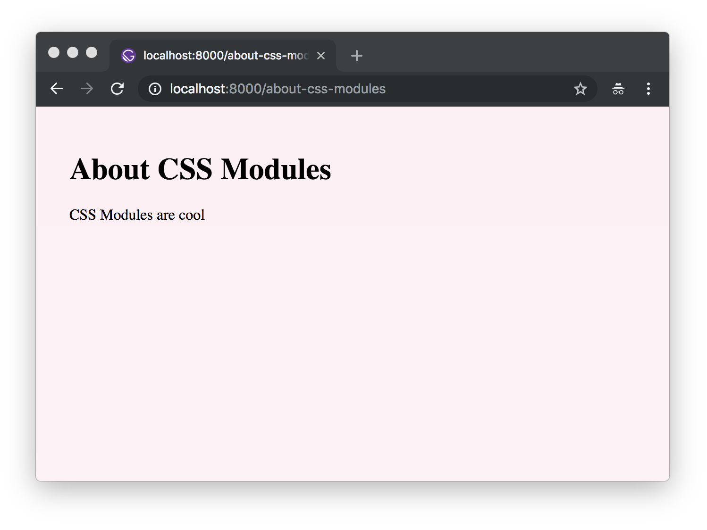
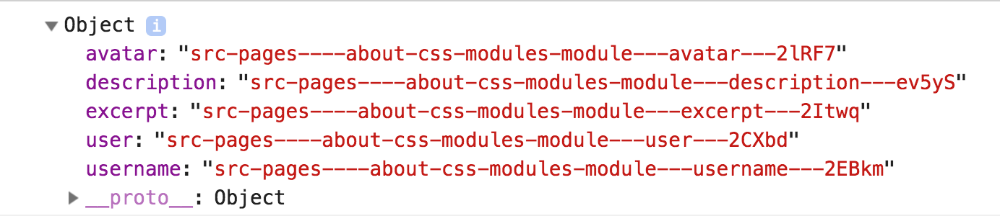
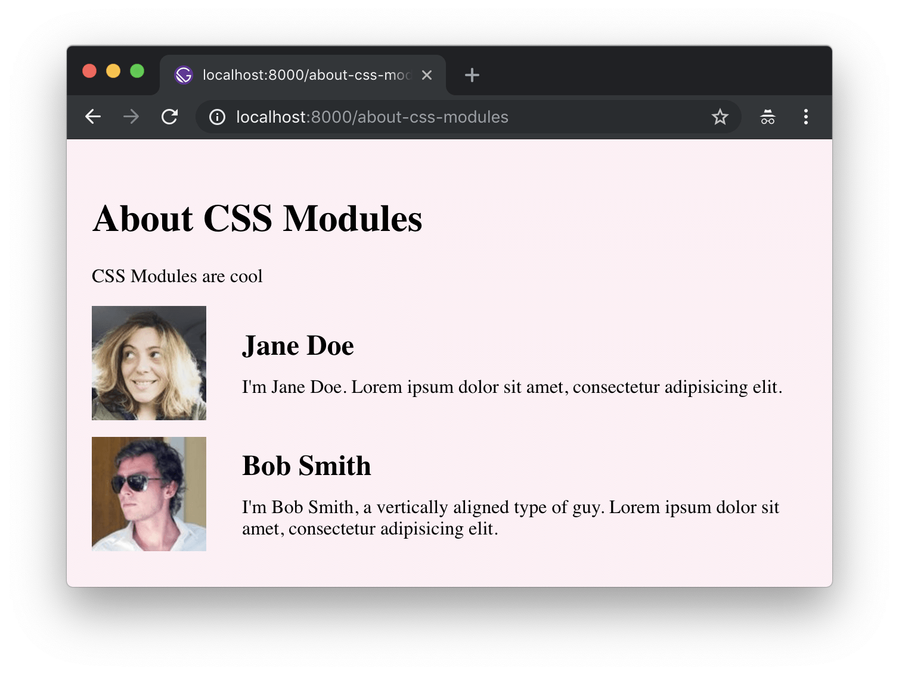

<!-- Idea: Create a glossary to refer to. A lot of these terms get jumbled -->

<!--
  - Global styles
  - Component css
  - CSS-in-JS
  - CSS Modules

-->

¡Bienvenido a la parte dos del tutorial de Gatsby!

## ¿Que abarca en este tutorial?

En esta parte, exploraras opciones para estilizar páginas web de Gatsby y a la vez interiorizarte en el uso de componentes React para crear sitios web.

## Usando estilos globales

Cada sitio web tiene cierto estilo global. Esto incluye cosas como la tipografía y los colores de fondo. Estos estilos definen la vista general del sitio - asi como el color y las texturas de una pared definen la vista general de una habitación.

### Creando estilos globales con archivos CSS normales

One of the most straightforward ways to add global styles to a site is using a global `.css` stylesheet.

Una de las maneras mas directas de agregar estilos globales a un sitio web es usando una hoja de estilos `.css` global

#### ✋ Crea un nuevo sitio web con Gatsby

Seria mejor (especialmente si eres nuevo con la linea de comandos) si cerraras el terminal que usaste para la [parte uno] (/tutorial/part-one/) e inicias una nueva sesion en otra terminal para la parte dos.

Open a new terminal window, create a new "hello world" gatsby site, and start the development server:

Abre una nueva terminal, crea un nuevo sitio web "hola mundo" con Gatsby e inicia el servidor de desarrollo:

```shell
gatsby new tutorial-parte-dos https://github.com/gatsbyjs/gatsby-starter-hello-world
cd tutorial-parte-dos
```

Ahora tienes un nuevo sitio web Gatsby (basado en el inicializador Gatsby "hola mundo") con la siguiente estructura:

```text
├── package.json
├── src
│   └── pages
│       └── index.js
```

#### ✋ Agrega estilos aun archivo css

1. Crea un archivo `.css` en tu proyecto nuevo:

```shell
cd src
mkdir styles
cd styles
touch global.css
```

> Nota: sientete libre de crear estos directorios y archivos usando tu editor de codigo, si así lo prefieres.

Ahora deberias tener una estructura como esta:

```text
├── package.json
├── src
│   └── pages
│       └── index.js
│   └── styles
│       └── global.css
```

2. Define algunos estilos en el archivo `global.css`:

```css:title=src/styles/global.css
html {
  background-color: lavenderblush;
}
```

> Nota: el lugar donde quede ubicado el archivo css de ejemplo en `/src/styles/` es irrelevante.

#### ✋ Incluye la hoja de estilos en `gatsby-browser.js`

1. Crea el `gatsby-browser.js`

```shell
cd ../..
touch gatsby-browser.js
```

La estructura de tu proyecto ahora debería verse así:

```text
├── package.json
├── src
│   └── pages
│       └── index.js
│   └── styles
│       └── global.css
├── gatsby-browser.js
```

> 💡 ¿Que es `gatsby-browser.js`? No te preocupes demasiado de eso ahora - por el momento, toma en cuenta que `gatsby-browser.js` es uno de los archivos especiales de mas ayuda que Gatsby busca y utiliza (si es que existe). Aquí, el nombre de el archivo **es** importante. Si quieres explorar más, revisa [los docs](/docs/browser-apis/).

2. Importa tu hoja de estilo recientemente creada en `gatsby-browser.js`:

```javascript:title=gatsby-browser.js
import "./src/styles/global.css"

// or:
// require('./src/styles/global.css')
```

> Nota: Ambas sintaxis CommonJS (`require`) y ES Module (`import`) funcionan. Si no sabes cual utilizar, nosotros usamos `import` la mayoria del tiempo.

3. Inicia el servidor de desarrollo:

```shell
gatsby develop
```

Si echas un vistazo a tu proyecto en el navegador, deberias ver el fondo de atras de color lavanda:



> Tip: Esta parte del tutorial se ha enfocado en la manera mas rapida y directa para iniciar a estilizar un sitio web Gatsby - importando directamente archivos CSS normales, usando `gatsby-browser.js`. En la mayoria de los casos, la mejor manera de agregar estilos globales es con un componente de diseño compartido. [Revisa la documentación](/docs/creating-global-styles/#how-to-add-global-styles-in-gatsby-with-standard-css-files) para saber mas acerca de esta aproximación.

## Usando CSS limitado al componente

So far, we've talked about the more traditional approach of using standard css stylesheets. Now, we'll talk about various methods of modularizing CSS to tackle styling in a component-oriented way.

Hasta aquí, hemos hablado acerca de la aproximación mas tradicional de usar hojas de estilo css normales. Ahora, hablaremos acerca de varios metodos de estructurar CSS para realizar estilos de una manera orientada a componentes.

### Módulos CSS

Exploremos **Módulos CSS**. Citando de
[la página Módulo CSS](https://github.com/css-modules/css-modules):

> Un **Módulo CSS** es un archivo CSS todos los nombres de las clases y animaciones
> están limitados localmente por defecto.

Los Modulos CSS so muy populares porque te permiten escribir CSS normalmente, pero con mayor confianza. La herramienta genera automaticamente nombres de clases y animaciones únicas, así que no tienes que preocuparte por colisiones de nombres en selectores de estilos.

Gatsby trabaja por defecto con Módulos CSS. Esta aproximación es muy recomendada para aquellos que son nuevos en Gatsby ( y en React en general).

#### ✋ Construye una nueva página web usando Modulos CSS

En esta sección, crearás un nuevo componente de página y le darás estilo a ese componente de página usando un Módulo CSS.

Primero, crea un nuevo componente `Container`.

1. Crea un nuevo directorio en `src/components` y despues, en este nuevo directorio, crea un archivo llamado `container.js` y pega lo siguiente:

```javascript:title=src/components/container.js
import React from "react"
import containerStyles from "./container.module.css"

export default ({ children }) => (
  <div className={containerStyles.container}>{children}</div>
)
```

Notaras que importamos un archivo llamado `container.module.css` que es un módulo css. Creemos ese archivo ahora.

2. En el mismo directorio (`src/components`), crea un archivo `container.module.css` y copia/pega lo siguiente:

```css:title=src/components/container.module.css
.container {
  margin: 3rem auto;
  max-width: 600px;
}
```

Notarás que el archivo termina con `.module.css` en vez del clásico `.css`. Es así como le indicas a Gatsby que este archivo CSS debe ser procesado como un módulo CSS en vez de un CSS plano.

3. Crea un nuevo componente de página, creando un archivo en
   `src/pages/about-css-modules.js`:

```javascript:title=src/pages/about-css-modules.js
import React from "react"

import Container from "../components/container"

export default () => (
  <Container>
    <h1>About CSS Modules</h1>
    <p>CSS Modules are cool</p>
  </Container>
)
```

Ahora, si visitas `http://localhost:8000/about-css-modules/`, tu página debería verse algo parecido a esto:



#### ✋ Dale estilo a un componente utilizando Modulos CSS

En esta sección, crearás una lista de personas con sus nombres, avatares y una biografía corta en latín. Crearás un componente `<User />` y le darás estilo a ese componente utilizando un modulo CSS.

1. Create the file for the CSS at `src/pages/about-css-modules.module.css`.

2. Paste the following into the new file:

```css:title=src/pages/about-css-modules.module.css
.user {
  display: flex;
  align-items: center;
  margin: 0 auto 12px auto;
}

.user:last-child {
  margin-bottom: 0;
}

.avatar {
  flex: 0 0 96px;
  width: 96px;
  height: 96px;
  margin: 0;
}

.description {
  flex: 1;
  margin-left: 18px;
  padding: 12px;
}

.username {
  margin: 0 0 12px 0;
  padding: 0;
}

.excerpt {
  margin: 0;
}
```

3. Import the new `src/pages/about-css-modules.module.css` file into the `about-css-modules.js` page you created earlier by editing the first few lines of the file like so:

```javascript:title=src/pages/about-css-modules.js
import React from "react"
// highlight-next-line
import styles from "./about-css-modules.module.css"
import Container from "../components/container"

// highlight-next-line
console.log(styles)
```

The `console.log(styles)` code will log the resulting import so you can see the result of your processed `./about-css-modules.module.css` file. If you open the developer console (using e.g. Firefox or Chrome's developer tools) in your browser, you'll see:



If you compare that to your CSS file, you'll see that each class is now a key in the imported object pointing to a long string e.g. `avatar` points to `src-pages----about-css-modules-module---avatar---2lRF7`. These are the class names CSS Modules generates. They're guaranteed to be unique across your site. And because you have to import them to use the classes, there's never any question about where some CSS is being used.

4. Create a `User` component.

Create a new `<User />` component inline in the `about-css-modules.js` page
component. Modify `about-css-modules.js` so it looks like the following:

```jsx:title=src/pages/about-css-modules.js
import React from "react"
import styles from "./about-css-modules.module.css"
import Container from "../components/container"

console.log(styles)

// highlight-start
const User = props => (
  <div className={styles.user}>
    
    <div className={styles.description}>
      <h2 className={styles.username}>{props.username}</h2>
      <p className={styles.excerpt}>{props.excerpt}</p>
    </div>
  </div>
)
// highlight-end

export default () => (
  <Container>
    <h1>About CSS Modules</h1>
    <p>CSS Modules are cool</p>
    {/* highlight-start */}
    <User
      username="Jane Doe"
      avatar="https://s3.amazonaws.com/uifaces/faces/twitter/adellecharles/128.jpg"
      excerpt="I'm Jane Doe. Lorem ipsum dolor sit amet, consectetur adipisicing elit."
    />
    <User
      username="Bob Smith"
      avatar="https://s3.amazonaws.com/uifaces/faces/twitter/vladarbatov/128.jpg"
      excerpt="I'm Bob Smith, a vertically aligned type of guy. Lorem ipsum dolor sit amet, consectetur adipisicing elit."
    />
    {/* highlight-end */}
  </Container>
)
```

> Tip: Generally, if you use a component in multiple places on a site, it should be in its own module file in the `components` directory. But, if it's used only in one file, create it inline.

The finished page should now look like:



### CSS-in-JS

CSS-in-JS is a component-oriented styling approach. Most generally, it is a pattern where [CSS is composed inline using JavaScript](https://reactjs.org/docs/faq-styling.html#what-is-css-in-js).

#### Using CSS-in-JS with Gatsby

There are many different CSS-in-JS libraries and many of them have Gatsby plugins already. We won't cover an example of CSS-in-JS in this initial tutorial, but we encourage you to [explore](/docs/styling/) what the ecosystem has to offer. There are mini-tutorials for two libraries, in particular, [Emotion](/docs/emotion/) and [Styled Components](/docs/styled-components/).

#### Suggested reading on CSS-in-JS

If you're interested in further reading, check out [Christopher "vjeux" Chedeau's 2014 presentation that sparked this movement](https://speakerdeck.com/vjeux/react-css-in-js) as well as [Mark Dalgleish's more recent post "A Unified Styling Language"](https://medium.com/seek-blog/a-unified-styling-language-d0c208de2660).

### Other CSS options

Gatsby supports almost every possible styling option (if there isn't a plugin yet for your favorite CSS option, [please contribute one!](/contributing/how-to-contribute/))

- [Typography.js](/packages/gatsby-plugin-typography/)
- [Sass](/packages/gatsby-plugin-sass/)
- [JSS](/packages/gatsby-plugin-jss/)
- [Stylus](/packages/gatsby-plugin-stylus/)
- [PostCSS](/packages/gatsby-plugin-postcss/)

and more!

## What's coming next?

Now continue on to [part three of the tutorial](/tutorial/part-three/), where you'll learn about Gatsby plugins and layout components.
