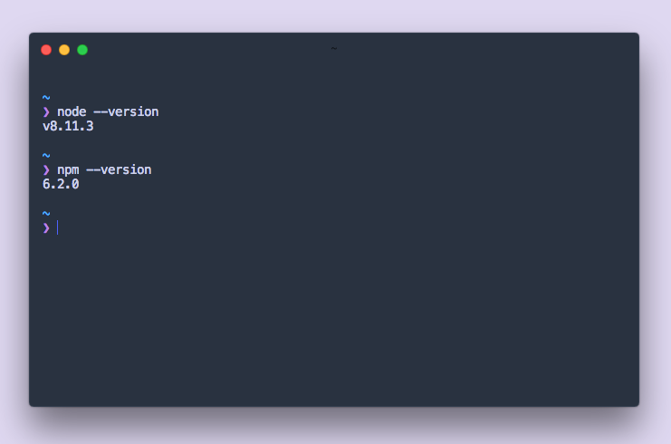
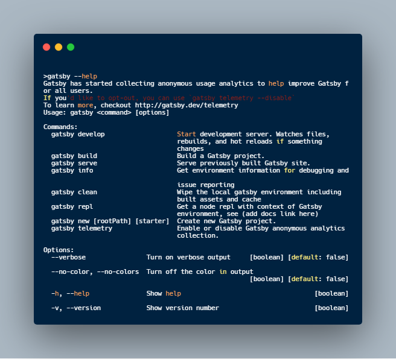
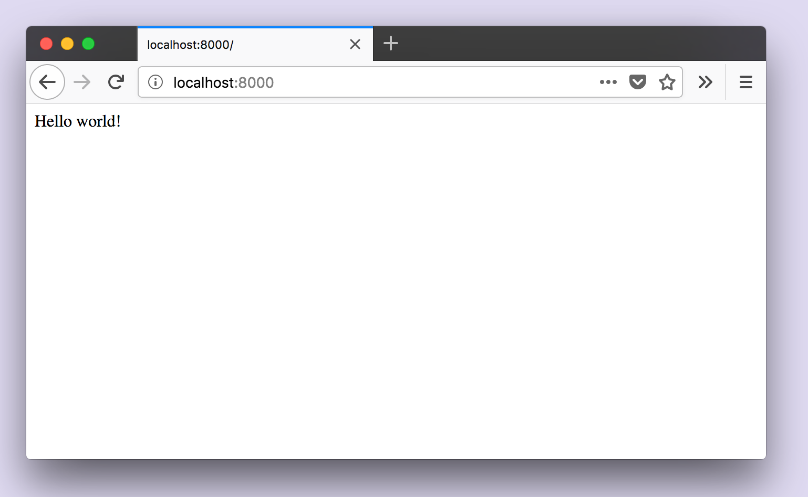

Antes de comenzar a crear tu primer sitio Gatsby, debes familiarizarte con algunas tecnologías web básicas y asegurarte de haber instalado todas las herramientas de software necesarias.

## Familiarízate con la línea de comandos

La línea de comandos es una interface de texto para ejecutar comandos en tu ordenador. Muchas veces nos referimos a ella como la terminal. En este tutorial lo llamaremos de ambas formas. Es muy parecido a usar el Finder en Mac o el Explorador en Windows. Finder y Explorer son ejemplos de Interfaz gráfica de usuario (GUI). La línea de comandos es una manera poderosa, basada en texto, para interactuar con tu ordenador.

Asegúrate de encontrar y abrir la interfaz de línea de comandos (CLI) de tu ordenador. Dependiendo de que sistema operativo estés usando, mira [**instrucciones para Mac**](http://foro-mac.com.ar/tutorial-como-usar-la-terminal-en-mac/), [**instrucciones para Windows**](https://www.xataka.com/basics/comandos-basicos-para-dar-tus-primeros-pasos-consola-windows-cmd) or [**instrucciones para Linux**](https://openwebinars.net/blog/La-guia-definitiva-para-aprender-a-usar-la-terminal-de-Linux/).

## Instalar Homebrew para Node.js

Para instalar Gatsby y Node.js, es recomendable usar [Homebrew](https://brew.sh/). Un poco de configuración al inicio te puede salvar de muchos dolores de cabeza más adelante!

Cómo instalar y verificar Homebrew en tu ordenador:

1. Abre la terminal
1. Mira si Homebrew está instalado ejecuntando `brew -v`. Deberías ver "Homebrew" y el número de versión.
1. Si no lo está, descárga e instala [Homebrew siguiendo las instrucciones (en inglés)](https://docs.brew.sh/Installation) para tu sistema operativo (Mac, Linux o Windows).
1. Una vez hayas instalado Homebrew, repite el paso 2 para verificarlo.

### Usuarios Mac: Instalar Xcode Command Line Tools

1. Abre la terminal.
1. En una Mac, instalamos Xcode Command line tools ejecutando `xcode-select --install`.
   1. Si eso falla, descárgalas [directamente del sitio web de Apple](https://developer.apple.com/download/more/), después de logarte con tu Cuenta de Developer de Apple.
1. Después de que el proceso de instalación haya empezado, se te solicitará nuevamente aceptar las licencias de las herramientas que se van a descargar.

## ⌚ Instala Node.js y npm

Node.js es un entorno que puede ejecutar código JavaScript fuera de un navegador web. Gatsby fue creado con Node.js. Para comenzar a utilizar Gatsby, debes tener instalada una versión reciente en tu ordenador.

_Note: La versión mínima soportada de Gatsby es Node 8, pero puedes usar una versión mas reciente._

1. Abre la terminal.
1. Ejecuta `brew update` para asegurarte de tener la última versión de Homebrew.
1. Ejecuta el siguiente comando para instalar Node y npm todo en uno: `brew install node`

Una vez hayas seguido los pasos para la instalación, asegurate que todo esté instalado correctamente:

### Verifica la instalación de Node.js

1.  Abre la terminal.
2.  Ejecuta `node --version`. (Si eres nuevo con la línea de comandos, "ejecuta `comando`" quiere decir "escribe `comando` en la ventana de comandos, y presiona la tecla Enter". De ahora en adelante, ésto es lo que nos referimos con "ejecuta `comando`").
3.  Ejecuta `npm --version`.

La respuesta de ambos comandos debe ser el número de versión. Las versiones que veas puede que no sean las mismas que te mostramos a continuación! Si despues de ejecutar esos comandos no te muestran las versiones, vuelve y asegúrate que hayas instalado Node.js.



## Instala Git

Git es un software de control de versiones distribuido y de software libre diseñado para gestionar proyectos ya sea pequeño o grande de una manera rápida y eficiente. Cuando instalas un "starter" de Gatsby, Gatsby usa Git internamente para descargar e instalar los ficheros requeridos para tu proyecto. Necesitarás Git instalado para configurar tu primer sitio web Gatsby.

Los pasos para descargar e instalar Git dependen de tu sistema operativo. Sigue los pasos para el tuyo:

- [Instala Git para macOS](https://filisantillan.com/como-instalar-git/#mac)
- [Instala Git para Windows](https://filisantillan.com/como-instalar-git/#windows)
- [Instala Git para Linux](https://filisantillan.com/como-instalar-git/#linux)

## Usando la Gatsby CLI

La línea de comandos de Gatsby (CLI) te permite crear rápidamente nuevos sitios web Gatsby y ejecutar comandos para el desarrollo de sitios web Gatsby. es un paquete npm público.

Gatsby CLI está disponible via npm y debe ser instalado de manera global en tu sistema con el comando `npm install -g gatsby-cli`.

Para ver los comandos disponibles, ejecuta `gatsby --help`.



> 💡 Si no puedes ejecutar la Gatsby CLI por un problema de permisos, quizás te interese mirar [la documentación de npm para solucionar el problema de los permisos (inglés)](https://docs.npmjs.com/getting-started/fixing-npm-permissions), o [ésta guía (inglés)](https://github.com/sindresorhus/guides/blob/master/npm-global-without-sudo.md).

###################################################

## Create a Gatsby site

Now you are ready to use the Gatsby CLI tool to create your first Gatsby site. Using the tool, you can download “starters” (partially built sites with some default configuration) to help you get moving faster on creating a certain type of site. The “Hello World” starter you’ll be using here is a starter with the bare essentials needed for a Gatsby site.

1.  Open up your terminal.
2.  Run `gatsby new hello-world https://github.com/gatsbyjs/gatsby-starter-hello-world`. (_Note: Depending on your download speed, the amount of time this takes will vary. For brevity's sake, the gif below was paused during part of the install_).
3.  Run `cd hello-world`.
4.  Run `gatsby develop`.

<video controls="controls" autoplay="true" loop="true">
  <source type="video/mp4" src="./03-create-site.mp4"></source>
  <p>Sorry! You browser doesn't support this video.</p>
</video>

What just happened?

```shell
gatsby new hello-world https://github.com/gatsbyjs/gatsby-starter-hello-world
```

- `new` is a gatsby command to create a new Gatsby project.
- Here, `hello-world` is an arbitrary title — you could pick anything. The CLI tool will place the code for your new site in a new folder called “hello-world”.
- Lastly, the GitHub URL specified points to a code repository that holds the starter code you want to use.

```shell
cd hello-world
```

- This says 'I want to change directories (`cd`) to the “hello-world” subfolder'. Whenever you want to run any commands for your site, you need to be in the context for that site (aka, your terminal needs to be pointed at the directory where your site code lives).

```shell
gatsby develop
```

- This command starts a development server. You will be able to see and interact with your new site in a development environment — local (on your computer, not published to the internet).

### View your site locally

Open up a new tab in your browser and navigate to [**http://localhost:8000**](http://localhost:8000/).



Congrats! This is the beginning of your very first Gatsby site! 🎉

You’ll be able to visit the site locally at [**_http://localhost:8000_**](http://localhost:8000/) for as long as your development server is running. That’s the process you started by running the `gatsby develop` command. To stop running that process (or to “stop running the development server”), go back to your terminal window, hold down the “control” key, and then hit “c” (ctrl-c). To start it again, run `gatsby develop` again!

**Note:** If you are using VM setup like `vagrant` and/or would like to listen on your local IP address, run `gatsby develop -- --host=0.0.0.0`. Now, the development server listens on both 'localhost' and your local IP.

## Set up a code editor

A code editor is a program designed specifically for editing computer code. There are many great ones out there.

> If you haven't worked with a code editor before, we recommend [**VS Code**](https://code.visualstudio.com/), simply because the screenshots used throughout the tutorial were taken in VS Code, and therefore may look more similar to your screen.

### Download VS Code

Gatsby documentation sometimes includes screenshots of code editors; these screenshots show the VS Code editor, so if you don't have a preferred code editor yet, using VS Code will make sure that your screen looks just like the screenshots in the tutorial and docs. If you choose to use VS Code, visit the [VS Code site](https://code.visualstudio.com/#alt-downloads) and download the version appropriate for your platform.

### Install the Prettier plugin

We also recommend using [Prettier](https://github.com/prettier/prettier), a tool that helps format your code to avoid errors.

You can use Prettier directly in your editor using the [Prettier VS Code plugin](https://github.com/prettier/prettier-vscode):

1.  Open the extensions view on VS Code (View => Extensions).
2.  Search for "Prettier - Code formatter".
3.  Click "Install". (After installation you'll be prompted to restart VS Code to enable the extension. Newer versions of VS Code will automatically enable the extension after download.)

> 💡 If you're not using VS Code, check out the Prettier docs for [install instructions](https://prettier.io/docs/en/install.html) or [other editor integrations](https://prettier.io/docs/en/editors.html).

## ➡️ What’s Next?

To summarize, in this section you:

- Learned about the command line and how to use it
- Installed and learned about Node.js and the npm CLI tool, the version control system Git, and the Gatsby CLI tool
- Generated a new Gatsby site using the Gatsby CLI tool
- Ran the Gatsby development server and visited your site locally
- Downloaded a code editor
- Installed a code formatter called Prettier

Now, move on to [**getting to know Gatsby building blocks**](/tutorial/part-one/).

## References

## Overview of core technologies

It’s not necessary to be an expert with these already — if you’re not, don’t worry! You’ll pick up a lot through the course of this tutorial series. These are some of the main web technologies you’ll use when building a Gatsby site:

- **HTML**: A markup language that every web browser is able to understand. It stands for HyperText Markup Language. HTML gives your web content a universal informational structure, defining things like headings, paragraphs, and more.
- **CSS**: A presentational language used to style the appearance of your web content (fonts, colors, layout, etc). It stands for Cascading Style Sheets.
- **JavaScript**: A programming language that helps us make the web dynamic and interactive.
- **React**: A code library (built with JavaScript) for building user interfaces. It’s the framework that Gatsby uses to build pages and structure content.
- **GraphQL**: A query language that allows you to pull data into your website. It’s the interface that Gatsby uses for managing site data.

## What is a website?

For a comprehensive introduction to what a website is--including an intro to HTML and CSS--check out “[**Building your first web page**](https://learn.shayhowe.com/html-css/building-your-first-web-page/)”. It’s a great place to start learning about the web. For a more hands-on introduction to [**HTML**](https://www.codecademy.com/learn/learn-html), [**CSS**](https://www.codecademy.com/learn/learn-css), and [**JavaScript**](https://www.codecademy.com/learn/introduction-to-javascript), check out the tutorials from Codecademy. [**React**](https://reactjs.org/tutorial/tutorial.html) and [**GraphQL**](http://graphql.org/graphql-js/) also have their own introductory tutorials.

## Learn more about the command line

For a great introduction to using the command line, check out [**Codecademy’s Command Line tutorial**](https://www.codecademy.com/courses/learn-the-command-line/lessons/navigation/exercises/your-first-command) for Mac and Linux users, and [**this tutorial**](https://www.computerhope.com/issues/chusedos.htm) for Windows users. Even if you are a Windows user, the first page of the Codecademy tutorial is a valuable read. It explains what the command line is, not just how to interface with it.

## Learn more about npm

npm is a JavaScript package manager. A package is a module of code that you can choose to include in your projects. If you just downloaded and installed Node.js, npm was installed with it!

npm has three distinct components: the npm website, the npm registry, and the npm command line interface (CLI).

- On the npm website, you can browse what JavaScript packages are available in the npm registry.
- The npm registry is a large database of information about JavaScript packages available on npm.
- Once you’ve identified a package you want, you can use the npm CLI to install it in your project or globally (like other CLI tools). The npm CLI is what talks to the registry — you generally only interact with the npm website or the npm CLI.

> 💡 Check out npm’s introduction, “[**What is npm?**](https://docs.npmjs.com/getting-started/what-is-npm)”.

## Learn more about Git

You will not need to know Git to complete this tutorial, but it is a very useful tool. If you are interested in learning more about version control, Git, and GitHub, check out GitHub's [Git Handbook](https://guides.github.com/introduction/git-handbook/).
